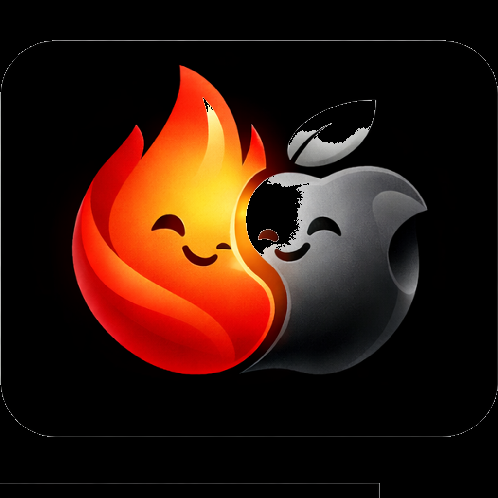

<p align="center">
  
</p>

<h1 align="center">FirePlay</h1>

<p align="center">
  <strong>Open-source AirPlay 2 receiver for Fire TV and Android TV.</strong>
</p>

<p align="center">
  <a href="#install">Install</a> ·
  <a href="#what-works">What works</a> ·
  <a href="#how-it-works">How it works</a> ·
  <a href="#build-from-source">Build</a> ·
  <a href="#credits">Credits</a>
</p>

<p align="center">
  
  
  
  
</p>

---

## Why

AirReceiver, AirScreen, and AirPin all charge money to do AirPlay on Fire TV.
Every open-source attempt I found on GitHub was either abandoned, audio-only,
or required a Raspberry Pi. FirePlay exists because Fire TV already has the
hardware to decode H.264 and play ALAC, and it should be able to do AirPlay
without a license fee or a second computer in the loop.

```
  iPhone                              Fire TV (FirePlay)
  ------                              ------------------
  Music       --  ALAC audio     -->  ALACDecoder  -->  AAudio out
  Photos      --  H.264 video    -->  AMediaCodec  -->  SurfaceView
  Video       --  AAC-ELD sound  -->  AMediaCodec  -->  AAudio out
  AirPlay 2   --  FairPlay pair  -->  UxPlay protocol library
```

## Install

### Downloader (easiest, no computer required)

Install the free **Downloader** app from the Amazon Appstore on your Fire TV.
Under `Settings -> My Fire TV -> Developer Options`, enable
**Install unknown apps** for Downloader. If Developer Options is hidden, go
to `Settings -> My Fire TV -> About` and click the "Fire TV" entry seven
times. Open Downloader, type `is.gd/fireplay_tv`, press Go, then Install,
then Open. You should see the FirePlay splash screen once the app boots.

On your iPhone, open Music or Photos, tap the AirPlay icon, and pick
FirePlay from the device list.

### ADB sideload

```bash
adb connect <fire-tv-ip>:5555
adb install FirePlay-v0.1.3.apk
```

APKs are attached to every [GitHub release](https://github.com/jimnoneill/FirePlay/releases).

### F-Droid

The F-Droid recipe lives at `metadata/org.fireplay.yml`. Submission to the
main F-Droid repo is planned once the v0.2 release cycle settles. Amazon
Appstore is deliberately not a target because Apple has a pattern of
DMCA-noticing AirPlay reimplementations on commercial stores.

## What works

On an iPhone 13 running iOS 18 talking to a Fire TV Cube 3rd gen (AFTGAZL)
on Fire OS 7.7.1, the following works reliably: lossless Apple Music
playback through the TV speakers, full-resolution photos, photo clip videos
with sound, and generic AirPlay video casts that use H.264 plus AAC-ELD.
iOS picks FirePlay out of the AirPlay device list the same way it picks an
Apple TV.

Two things don't work yet. iPhone screen mirroring from Control Center is
a separate protocol path and is slated for v0.2. Netflix, Disney+, HBO,
and anything else wrapped in FairPlay DRM will never cast to FirePlay,
because Apple doesn't license FairPlay to third-party receivers. That's
a platform restriction, not a bug in this project.

## Status

| Piece | State |
|---|---|
| mDNS advertisement via JmDNS | works |
| iOS 17/18 pairing (FairPlay 2-round) | works |
| Music playback, ALAC to AAudio | works |
| Photo + video path, H.264 via MediaCodec to SurfaceView | works |
| Video sound, AAC-ELD via MediaCodec to AAudio | works |
| Per-device identity on multi-receiver LANs | works |
| Auto-launch when iPhone connects, including cold boot | works |
| iPhone screen mirroring | planned for v0.2 |
| F-Droid submission | planned for v0.2 |

## How it works

The protocol layer under `lib-uxplay/` is a vendored copy of
[FDH2/UxPlay](https://github.com/FDH2/UxPlay) (GPL-3). It handles SRP-6a
pairing, FairPlay emulation, RAOP RTP demux, and NTP sync. Everything
above that is native Android.

Audio runs through `audio_renderer_aaudio.cpp`. ALAC packets from the
Music app go through Apple's open-source
[ALACDecoder](https://github.com/macosforge/alac), produce PCM, and land
on an AAudio output stream. AAC-ELD from video sources takes a detour
through `AMediaCodec` on the way to the same stream.

Video runs through `video_renderer_mediacodec.cpp`. H.264 NAL units from
the iPhone feed straight into `AMediaCodec` configured for hardware
decoding. The decoder writes directly to an `ANativeWindow` backing a
SurfaceView, so frames never touch the CPU after they arrive.

Discovery was the painful part. Android's built-in `NsdManager` advertises
well enough for Android clients but flakes out with Apple's `dnssd` resolver,
especially in the face of background renotification. The fix was dropping
back to [JmDNS](https://github.com/jmdns/jmdns) and building the Bonjour
TXT record by hand so it matches what a real AirPlay 2 receiver broadcasts.

## Build from source

You need Android NDK r27 or newer, an SDK with `platforms;android-28`, and
JDK 17. On Linux or macOS:

```bash
git clone https://github.com/jimnoneill/FirePlay
cd FirePlay
./gradlew :app:assembleDebug
adb install app/build/outputs/apk/debug/app-debug.apk
```

On Windows ARM64 the `build.ps1` helper sets up the env vars that gradle
otherwise can't find. Edit `local.properties` with your SDK and NDK paths
first.

The APK ships both `armeabi-v7a` and `arm64-v8a` native libraries, so any
Fire TV or Android TV running Android 9 or newer should install and run.

## Credits

This project stands on top of other people's work:

- [FDH2/UxPlay](https://github.com/FDH2/UxPlay), the AirPlay 2 protocol
  stack, vendored under `lib-uxplay/` (GPL-3).
- [macosforge/alac](https://github.com/macosforge/alac), Apple's
  open-source ALAC decoder (APSL).
- [KDAB/android_openssl](https://github.com/KDAB/android_openssl), prebuilt
  OpenSSL for Android.
- [libimobiledevice/libplist](https://github.com/libimobiledevice/libplist),
  the Apple property list parser (LGPL-2.1).
- [jmdns/jmdns](https://github.com/jmdns/jmdns), Apple-compatible Bonjour
  in pure Java.

## Support

If FirePlay saved you the AirReceiver subscription, or if you just think
open-source AirPlay on Android should exist, contributions toward keeping
it maintained are welcome.

<p align="center">
  <a href="https://paypal.me/jimnoneill"></a>
</p>

## License

GPL-3.0, inherited from UxPlay. See [LICENSE](LICENSE).
